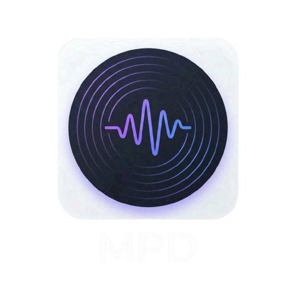

<p align="center">
  
</p>

# MPD Presence 🎶

A lightweight Rust application that bridges **MPD (Music Player Daemon)** with **Discord Rich Presence**. It automatically displays your currently playing song, artist, and album, along with **embedded album art**.


## ✨ Features

- **Embedded Album Art**: Automatically extracts `CoverFront` images from your audio files (MP3, FLAC, etc.) using `lofty`.
- **Automatic Uploads**: Uploads artwork to `litterbox.catbox.moe` on-the-fly to display them in Discord.
- **Smart Caching**: In-memory caching ensures that the same album art isn't re-uploaded multiple times.
- **Real-time Updates**: Listens to MPD idle events to update your status instantly when the song changes.
- **Systemd Integration**: Includes a user service to run in the background on startup.

## 🚀 Installation

### Prerequisites

- `mpd` running on your system.
- `rust` and `cargo` installed.

### Build and Install

1. Clone the repository:
   ```bash
   git clone https://github.com/r3dg0d/mpd-presence.git
   cd mpd-presence
   ```

2. Build and install the binary:
   ```bash
   cargo build --release
   mkdir -p ~/.local/bin
   cp target/release/mpd-presence ~/.local/bin/
   ```

3. Set up the systemd service:
   ```bash
   mkdir -p ~/.config/systemd/user/
   cp mpd-presence.service ~/.config/systemd/user/
   systemctl --user daemon-reload
   systemctl --user enable --now mpd-presence
   ```

## ⚙️ Configuration

You can configure the application via environment variables or by editing the service file:

- `DISCORD_APP_ID`: Your Discord Application ID (Defaults to hardcoded one).
- `MPD_MUSIC_DIR`: Path to your music library (Defaults to `~/Music`).

## 🛠️ Development

To run locally with debug logging:
```bash
cargo run
```

## 📜 License

MIT
